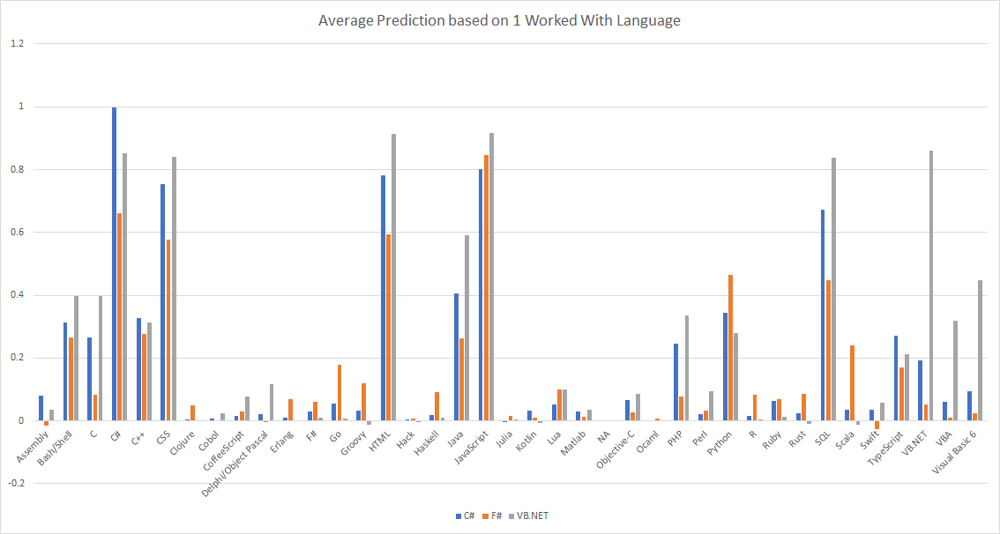
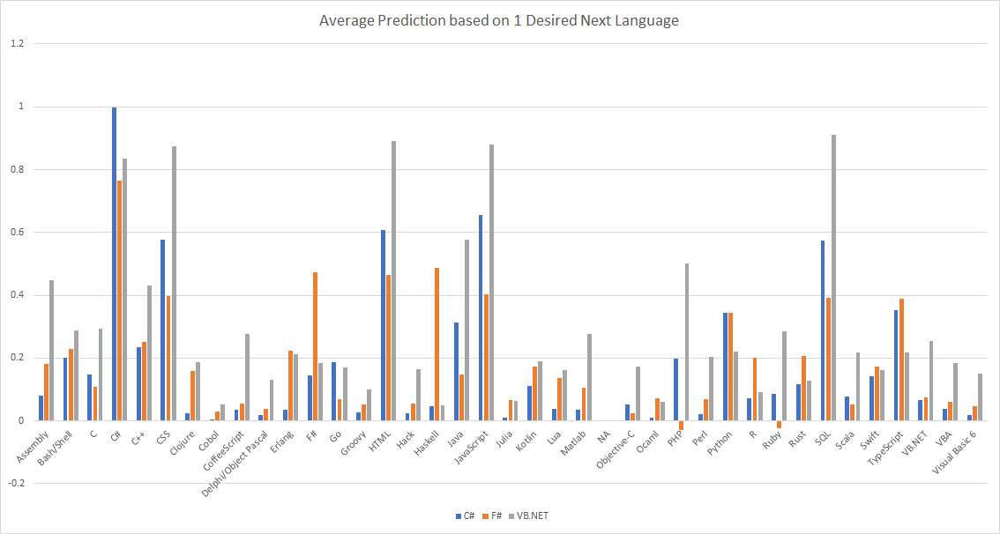

# Language Recommendation using F#/Math.NET Numerics and Stack Overflow

This project uses matrix factorization (singular value decomposition) to predict languages developers use and wish to learn, based on the 2018 Stack Overflow Developer Survey. Inspired by [Nick Becker's](https://beckernick.github.io/matrix-factorization-recommender/) Python tutorial.

## Simple Insights

The initial idea of the project was to try and predict what language someone should learn based on the languages they already know.

The approximation used a rank 20 singular value matrix, then averaged the predicted values for each language for users that worked with/desired one language. Only IDs below 1000 were used. Included in the [results](LanguageSuggestionML/results) directory are the CSVs for worked with languages and desired next year languages.

Below are charts for predictions given a .NET language (C#, F#, VB.NET), firstly in a "worked with" context and secondly in a "desired to work with" context".

For languages that fewer survey participants knew/wanted to work with, the prediction are lower, even in the case where the users know the language (see F# and F# predictions). However, the relative predictions are interesting: for example, F# developers are more likely to work with functional languages.

## Using the Project

Download the dataset from [Stack Overflow](https://insights.stackoverflow.com/survey) (expected to be in the root of the directory).

Requires the .NET Core SDK. Visual Studio or Visual Studio Code + Ionide would be the recommended ways of directly editing the project.